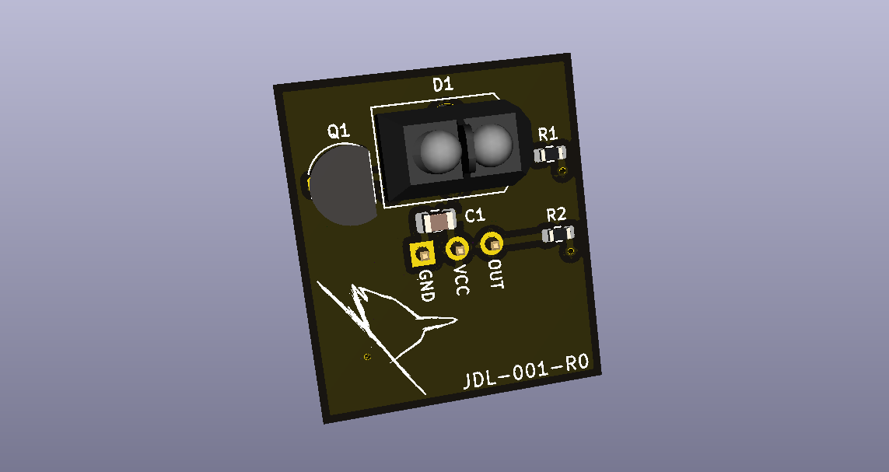

# Optical Tachometer Hardware

The `optical_tachometer_hardware` project consists of a single printed circuit board (PCB)
which contains a TCRT5000 reflective sensor and its supporting circuitry. The device's
physical interface is a three position right-angle pin header.

## Usage
Built-up hardware is a sensor module designed to be interfaced with a General Purpose
Input/Output (GPIO) pin on a microcontroller. The sensor is active-high, and asserts its
output when in close proximity to a reflective object.

## License [Apache 2.0](http://www.apache.org/licenses/)
